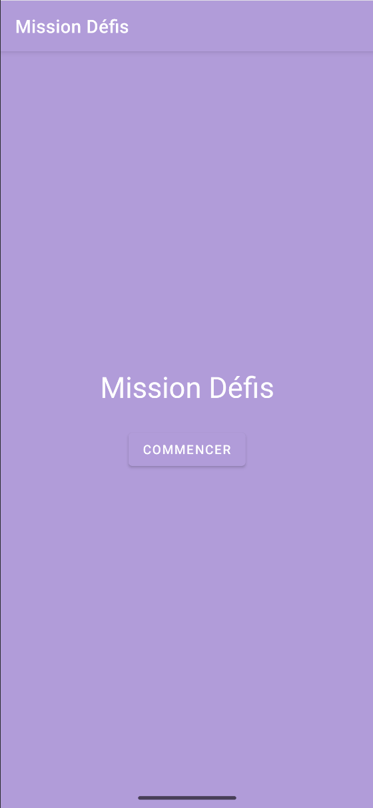
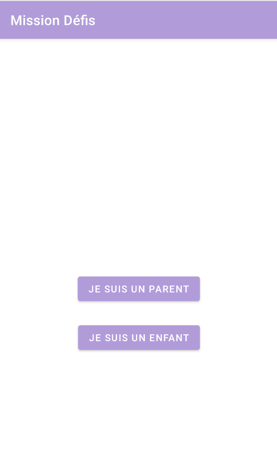
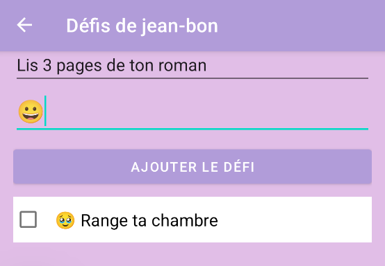
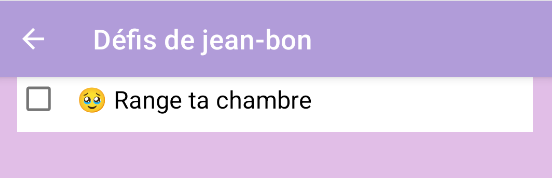
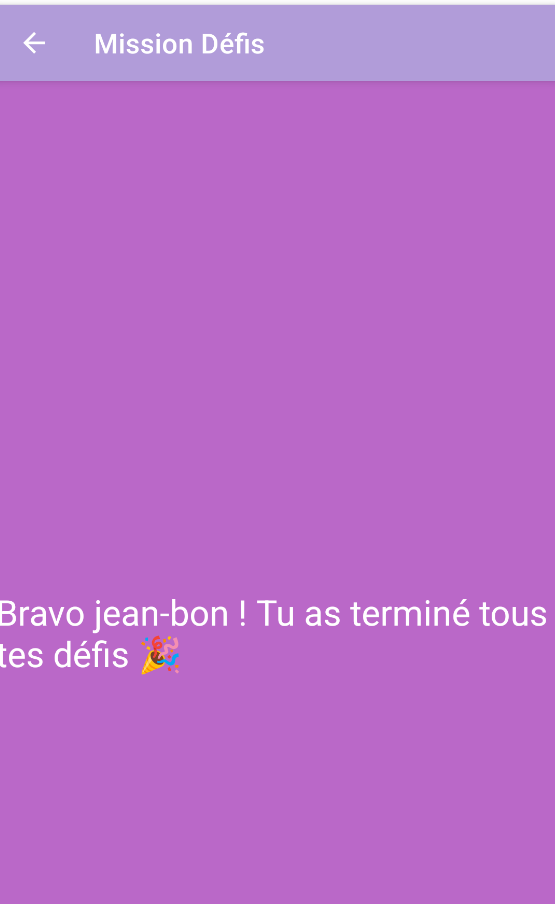

# Mission Défis
Mission Defis is an Android application designed to engage children with fun daily challenges.

## 🛠️ Tech stack
- Android / Kotlin
- MVVM architecture
- Room DB
- ViewModel + LiveData
- XML layouts
- Material Design 3

## 🚀 Getting started
1. Clone the repository
2. Open with Android Studio
3. Sync Gradle
4. Run on emulator or real device

## 🧸 License
Code is open for educational and personal use. Contact the author for redistribution or commercial use.

## Screenshots

Home screen :  
  
  
Select a person :    
  
  
Create a new child :  
   
  
Add a challenge :   
  
  
View challenges for child :   
  
  
Reward when all challenges are completed :   

